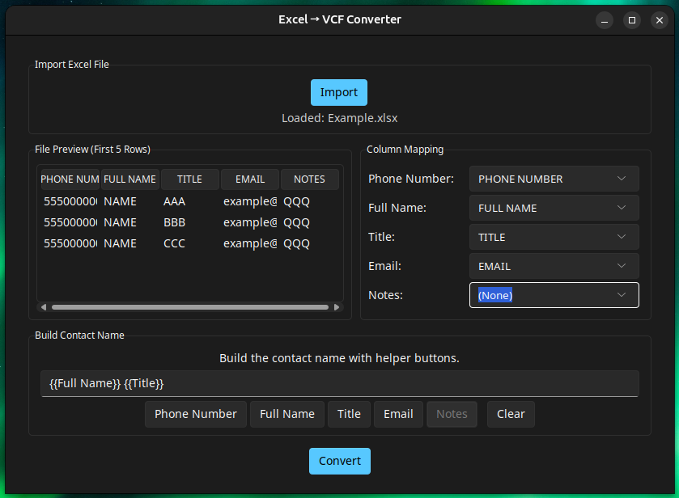

## 📊 Excel → VCF Converter
* A simple, cross-platform desktop application built with Python and Tkinter (`sv_ttk`) that allows you to easily convert contact data from an **Excel (.xlsx/.xls) file** into the **VCF (vCard) format**.

## Features
* **GUI Interface:** Easy-to-use graphical interface built with Tkinter and styled using `sv_ttk`.
* **Custom Mapping:** Map your Excel columns (e.g., "Phone," "Email," "Full Name") to standard VCF fields.
* **Flexible Naming:** Build a custom name format using multiple columns.
* **VCF Compliance:** Generates fully compliant VCF 3.0 files, ensuring compatibility with most modern phone systems.
## Installation & Running
* The script automates the setup on Linux/macOS. Windows requires manual steps.
### Linux & macOS
1. Make the script executable:
   `chmod +x run.sh`
2. Run the script:
   `./run.sh`
### Windows
1. Create a virtual environment:
   `python -m venv env`
2. Activate the environment:
   `\env\Scripts\activate`
3. Install the required libraries:
   `pip install -r requirements.txt`
4. Run the application:
   `python main_app.py`
## MIT License
`Copyright (c) [2025] [Majtreax]`
* Permission is hereby granted, free of charge, to any person obtaining a copy
of this software and associated documentation files (the "Software"), to deal
in the Software without restriction, including without limitation the rights
to use, copy, modify, merge, publish, distribute, sublicense, and/or sell
copies of the Software, and to permit persons to whom the Software is
furnished to do so, subject to the following conditions:
The above copyright notice and this permission notice shall be included in all
copies or substantial portions of the Software.
* THE SOFTWARE IS PROVIDED "AS IS", WITHOUT WARRANTY OF ANY KIND, EXPRESS OR
IMPLIED, INCLUDING BUT NOT LIMITED TO THE WARRANTIES OF MERCHANTABILITY,
FITNESS FOR A PARTICULAR PURPOSE AND NONINFRINGEMENT. IN NO EVENT SHALL THE
AUTHORS OR COPYRIGHT HOLDERS BE LIABLE FOR ANY CLAIM, DAMAGES OR OTHER
LIABILITY, WHETHER IN AN ACTION OF CONTRACT, TORT OR OTHERWISE, ARISING FROM,
OUT OF OR IN CONNECTION WITH THE SOFTWARE OR THE USE OR OTHER DEALINGS IN THE
SOFTWARE.

